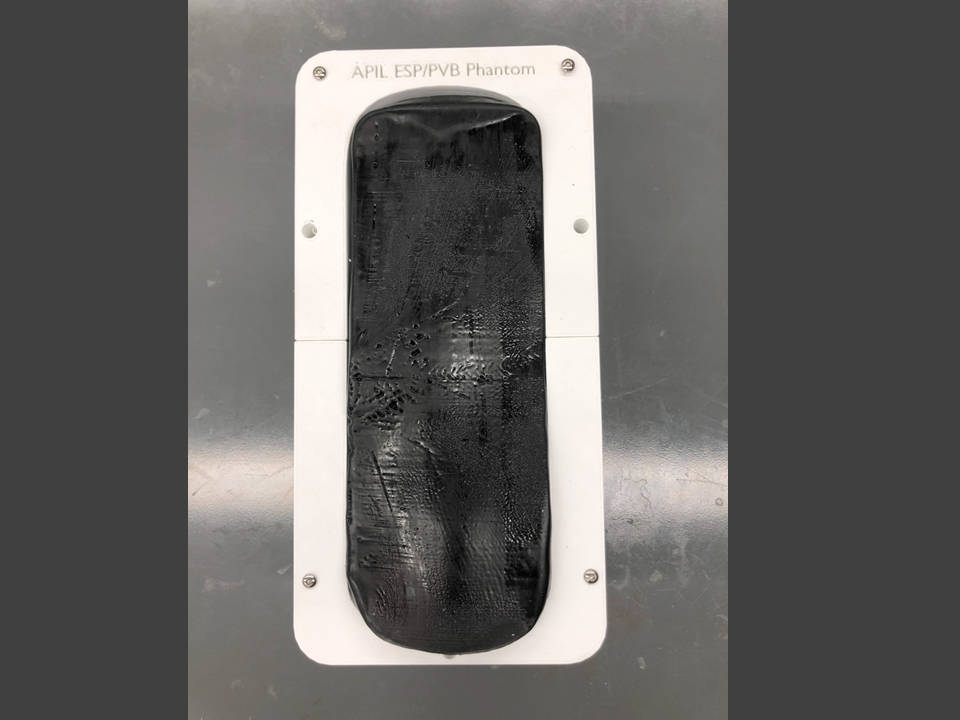
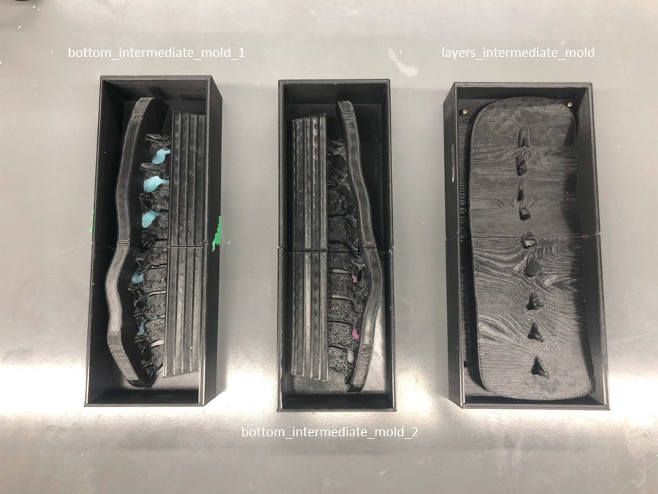
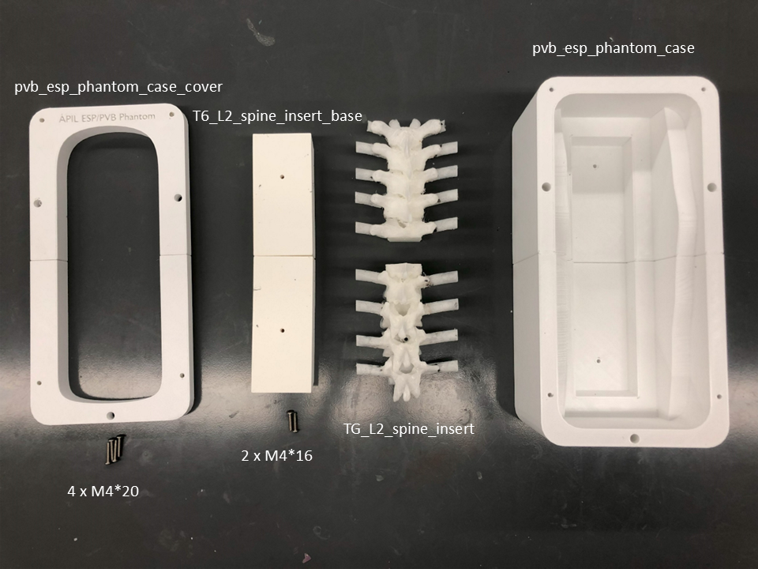
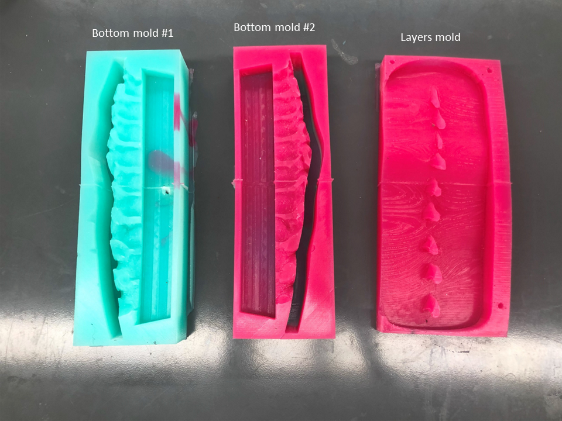

# APIL PVB/ESP Spine Phantom

**NOTE:** This is a **highly** experimental phantom.  Due to the number of individual muscle layers, size of each layer, and complexity of layer fusion, this phantom has a very low yield.  We are currently in the process of updating and experimenting further with this phantom.

3D Printed mid-thoracic (T6 - L2) spine based on CT data.  Our spine phantom is encased in an synthetic, shelf-stable gel which has a realistic tactile feel to human muscle and is echogenic.  This phantom contains individual muscle layers to simulate the trapezius, rhomboid, and erector spinae muscles.  These layers are distinct which and which allows a bolus of fluid to be deposited between any of the layers.  A bolus of fluid can also be deposited underneath the transverse process to simulate entering the potential space of the PVB technique.

This model was developed at the [Lynn & Arnold Irwin Advanced Perioperative Imaging Lab](https://apil.ca), Toronto General Hospital, University Health Network.

# Purchasing Information
To purchase this phantom, please email <apil@uhn.ca> and a represtative will be in touch with you with more details.

**A purchased phantom contains the following**:

1. Fully assembled scoliotic spine phantom.
2. Custom table clamp to hold phantom to tabe surface

# Ultrasound Images
Coming soon

# Care and Maintenance
1. Apply generous amount of ultrasound gel to surface of phantom.
2. When attempting the PVB technique, the fluid will collect in the 3D printed case automatically.  Please empty the collected fluid after every use.

# Materials & Equipment

## Hardware

- M5*14 pins
- 2 x M4*16 Bolts
- 4 x M4*20 Bolts
- Heat gun
- Super glue

## Printing Equipment

- Polylactic Acid (PLA)
- High temperature PLA (htPLA)
- Bridge Nylon
- Fused Deposition Modelling 3D printer

## Casting Equipment

- Ballistics Gel
  - Gelatin #3 from [Humimic Medical](https://humimic.com/product/gelatin-3-medical-gel-by-the-pound/)
- Graphite Powder (optional)
  - used to replicate echogenic scatter of muscle
- Slowcooker
- Two-part Platinum Cure Silicone Rubber (or equivalent)
  - Available from [Smooth-On](https://www.smooth-on.com/products/dragon-skin-30/)
- Degas Chamber (Optional)

# Assembly Instructions

## Printing

This repo includes **stl** files for each printed part.

In general, we use the following settings for *all* parts of this phantom:

<table>
    <tr>
        <td><b>Material</b></td>
        <td><b>Colour</b></td>
        <td><b>Nozzle Temp (C)</b></td>
        <td><b>Bed Temp (C)</b></td>
        <td><b>Infill (%)</b></td>
        <td><b>Perimiters (#)</b></td>
    </tr>
    <tr>
        <td>PLA</td>
        <td>White</td>
        <td>210.0</td>
        <td>60.0</td>
        <td>10.0</td>
        <td>2</td>
    </tr>
    <tr>
        <td>htPLA</td>
        <td>White</td>
        <td>210.0</td>
        <td>60.0</td>
        <td>10.0</td>
        <td>2</td>
    </tr>
    <tr>
        <td>Bridge Nylon</td>
        <td>Natural</td>
        <td>250.0</td>
        <td>80.0</td>
        <td>15.0</td>
        <td>3</td>
    </tr>
</table>

## Silicone Casting

### Silicone Mold Casting

1. Print all components in the directory */molds/* using the PLA printing settings outlined above.
2. Assemble bottom_intermediate_mold_1a, 1b and bottom_intermediate_mold_2a, 2btogether using M5*14 pins.
3. Assemble layers_intermediate_mold_1 and 2 together using M5*14 pins.
4. Mix **3000 g** of silicone according to manufacturers instructions.
    - Degassing the silicone is encoraged, but optional.
    - Adding colourant to silicone is optional.
5. Pour silicone into the assembled molds until flush with top surface.
6. Allow silicone to cure according to manufacturer's instructions.
7. Carefully disassmble the mold and release the silicone.
   - **NOTE:** This step can be very difficult.  Procede with caution and patience to avoid damaging the silicone shell.

## 3D Printing Components

1. Print all components in the directory */insert/* 
   1. Use Bridge printing settings for T6_L2_spine_insert_1 and 2.
   2. Use htPLA printing settings for T6_L2_spine_insert_base_1 and 2. 
2. Print all components in the directory */case/* using the PLA printing settings outlined above.
3. Carefully remove supports from the part when complete.
   1. You can leave the supports underneath the spinous processes.
4. Assemble the printed base with 2 x M5*14 pins
5. Assemble the two spine halves to the base with 2 x M4*16
   1. the spine halves can rotate -- this is a design choice to make it easier to position inside the molds in the next step.
6. Assemble pvb_esp_phantom_case_1 and 2 with 2 x M5*14 pins and super glue.
7. Assemble pvb_esp_pahantom_case_cover_1 and 2 with 2 x M5*14 pins and super glue.

## Ballistics Gel Casting

1. **CAUTION:** Use appropriate heat-proof gloves when working with liquefied ballistic gel and/or heat gun.
2. **CAUTION:** work **only** in a very well ventilated area.  A fumehood is *highly* recommended.

### Ballistics Gel Casting

1. Melt at least **1500 g** gel in crockpot @ 105C - 115C (approx. 225F - 240F).
2. If the gel does not contain graphite powder, slowly add graphite powder into fully liquefied mixture until saturated.
3. Once the gel is fully liquefied, pour into one of the bottom silicone molds until gel is flush with the top of the mold.
4. Insert the assembled spine insert into the bottom silicone mold.
5. Allow gel to cool and repeat for second bottom silicone mold.
6. Pour gel into the layers mold until surface is smooth and flat
7. Allow gel to cool and remove from mold.  This is the first muscle layer for the PVB/ESP phantom.
8. Apply the heat gun set to 400C to the underside of the resulting muscle layer.  Move the heat gun evenly accross the surface until it is smooth.
   1. It is crtiical that both sides of the muscle layers are smooth and free of defects otherwise the ultrasound signal may be occluded.
   2. It is critical that that the heat gun be moving constantly or you risk deforming the surface.  The geometry of the muscle is critical to having adequate contact between the gel layers for adequate imaging.
9.  repeat steps 6 -> 8 two more times to produce a total of 3 muscle layers (trapezius, rhomboid, and erector spinae muscles)
10. layer each muscle on to the assembled spine insert.

## Gel Layer Fusion

1. Apply the heat gun set to 400C around the perimeter of the gel layers.
2. Constantly move the heat gun to prevent over-melting of layers.
3. the goal is to fuse the outermost surface of the gel layers **only**.
4. Allow gels to cool completely.  

## Phantom Assembly

1. Place assembled spine insert with gel into assembled case.
2. Attach assembled case cover to the case with 4 x M4*20 bolts.